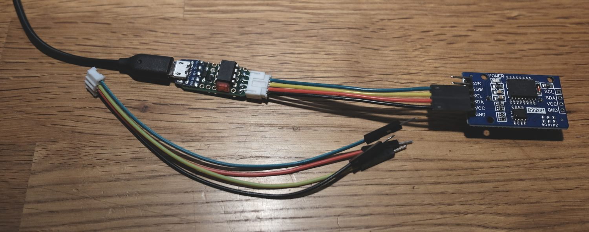
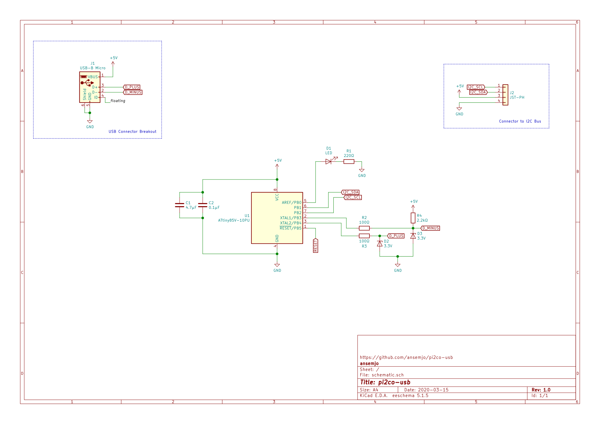
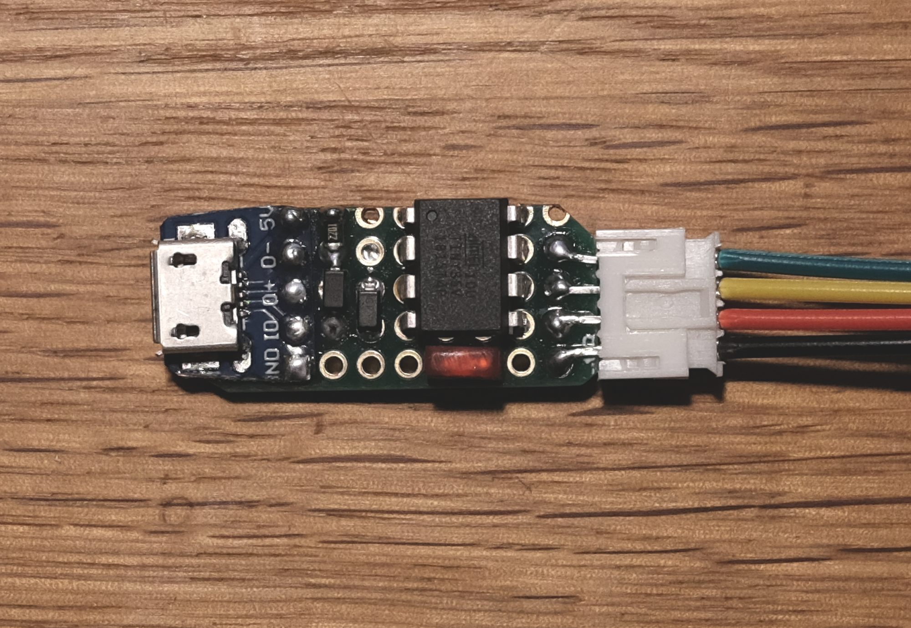
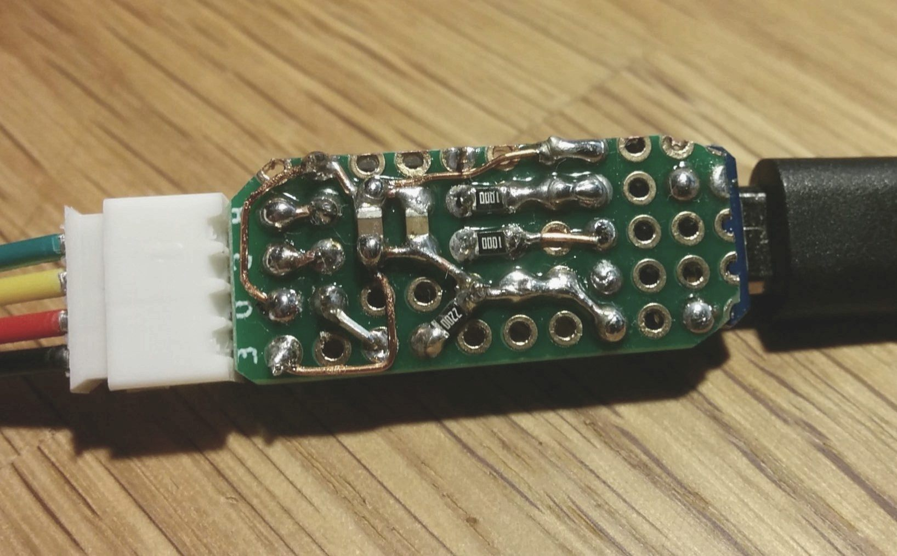

# pi2co-usb

This project is based on [i2c-tiny-usb](https://github.com/harbaum/I2C-Tiny-USB/) by Till Harbaum and the [V-USB stack](https://www.obdev.at/products/vusb/index.html) by Objective Development. It uses the fact that you can implement a low-speed USB device with the IO pins on an Atmel AVR chip to create a very simple I2C bridge.



## Hardware

In the original `i2c-tiny-usb` implementation, an Atmel AVR ATtiny45 was used with an external oscillator. Unfortunately this meant, that you needed to use all six pins on the chip, reconfigure the RESET pin and therefore needed a high-voltage serial programmer (HVSP) should anything go wrong.

On more recent Digispark devices, which use an ATtiny85, a modified version of the V-USB stack is used with only the internal PLL oscillator calibrated to 16.5 MHz. No external chrystal is required, ISP remains available and you can even connect an indicator LED on the remaining pin.

I had a couple of Atmel AVR ATtiny85V-10PU chips and a small leftover piece of protoboard. Enough to build myself an I2C bridge! I used a JST-PH connector on the I2C side, which has a slightly too narrow pitch but it works out with a 4-pin connector if you solder it at the edge of the board. Also I had lots of connectors, so I could crimp myself some cables.

Here is a simple [schematic](schematic.pdf) of the protoboard version that you see below on the photos:






## Software

The firmware is almost fully plucked from Till Harbaum's `i2c-tiny-usb` project, so most credit goes to him. I converted the directory to a PlatformIO project, updated the vendored V-USB stack and modified the configuration header to use a different pinout.

It is meant to work together with a current [micronucleus](https://github.com/micronucleus/micronucleus/) bootloader, which allows loading new firmware over the same USB port that is used in the userspace firmware. This implementation also relies on the oscillator calibration included in the bootloader to achieve a stable 16.5 MHz clock.

### Flash the Bootloader

At first I used a default release for the ATtiny85 that I flashed with an ISP programmer and later changed a few options to enable the indicator LED, enter the bootloader only after shorting the RESET pin and disable the timeout. The configuration can be found in `bootloader/t85_pi2co` and can be linked or copied to a micronucleus project under `firmware/configuration/`.

For example, to compile the firmware with the config profile above and flash it with an [Adafruit FT232H breakout](https://wiki.semjonov.de/tips/arduino.html#adafruit-ftdi-ft232h-breakout-board):

```sh
make clean
make CONFIG=t85_pi2co
make CONFIG=t85_pi2co PROGRAMMER="-c ft232h" flash
make CONFIG=t85_pi2co PROGRAMMER="-c ft232h" fuse
```

After that you should be able to speak to the chip with the `micronucleus` commandline application if you connect a USB breakout appropriately. **To enter the bootloader later**, you'll need to reset the chip by briefly shorting the RESET pin to ground.

To allow normal users to speak with the bootloader, apply the
udev rules found in [49-micronucleus.rules](https://github.com/micronucleus/micronucleus/blob/e74ce6f064e0bcbe1c52459a0988187c76834222/commandline/49-micronucleus.rules).

### Flash the Firmware

Now that the bootloader works, install [PlatformIO](https://platformio.org/) and go to the `firmware/` directory. You can now compile the firmware simply by running `pio run`. PlatformIO should handle all framework and platform dependencies for you.

Afterwards flash the firmware by running:

```sh
pio run -t upload
```

**Note:** PlatformIO currently ships an outdated version of the `micronucleus` commandline tool, which won't speak to the current bootloader releases. Either update the binary in `~/.platformio/packages/tool-micronucleus/` or use a current binary with the compiled firmware directly:

```sh
micronucleus .pio/build/tiny85/firmware.hex
```

### Kernel driver

The `i2c-tiny-usb` project has been around for a while, so it already has a driver in the mainline Linux kernel. I only needed to `modprobe i2c-dev` for the device to appear. Install the `i2c-tools` in your Linux distribution of choice and start talking to I2C devices. You may need to run the tools as `root`.

As an example I am reading the date and time from a DS3231 RTC clock:

```sh
$ sudo i2cdetect -l
[sudo] password for ansemjo: 
/* ... */
i2c-10	i2c       	i2c-tiny-usb at bus 001 device 028	I2C adapter
/* ... */

$ sudo i2cdetect -y 10
     0  1  2  3  4  5  6  7  8  9  a  b  c  d  e  f
00:          -- -- -- -- -- -- -- -- -- -- -- -- -- 
10: -- -- -- -- -- -- -- -- -- -- -- -- -- -- -- -- 
20: -- -- -- -- -- -- -- -- -- -- -- -- -- -- -- -- 
30: -- -- -- -- -- -- -- -- -- -- -- -- -- -- -- -- 
40: -- -- -- -- -- -- -- -- -- -- -- -- -- -- -- -- 
50: -- -- -- -- -- -- -- 57 -- -- -- -- -- -- -- -- 
60: -- -- -- -- -- -- -- -- 68 -- -- -- -- -- -- --  << this is the rtc
70: -- -- -- -- -- -- -- --                         

$ i=0; for value in seconds minutes hours weekday day month year; do \
> printf '%7s: %s\n' $value "$(sudo i2cget -y 10 0x68 $i)"; : $((i++)); done
seconds: 0x39
minutes: 0x07
  hours: 0x19
weekday: 0x07
    day: 0x15
  month: 0x03
   year: 0x20
```

The bytes need BCD decoding but you can see the date was `2020-03-15 19:07:39`.
